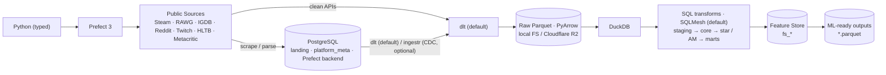

# OGIP — Creation Plan

**OGIP · Open Games Intelligence Platform** — an end-to-end **Market Intelligence
Platform** that continuously collects public gaming-market data, transforms it into
analytical datasets, and ships **ML-ready outputs** (incl. a feature store) for Data
Scientists, ML Engineers, and Data Analysts.

> Blueprint for creating OGIP as a **new project at its own path** (`~/gi/@dataengy/OGIP`),
> derived from — but reshaped from — the existing OGAP repo (`~/gi/@dataengy/Hushcrasher`).
> Nothing is built yet beyond `.ai/` + `docs/` stubs; the build starts at Phase 0 only after
> this plan is approved.

- **Part A — Target design** · **Part B — Creation plan (phased)** · **Part C — Locked decisions**

---

## 0. The one thing this repo must signal

A reader skims the README and the tree and concludes:

> "This engineer can build a **production data platform for a startup** like Hushcrasher."

The **production path stays lean and modern**; everything exploratory (extra engines,
feature-store tooling, visualizers, semantic layers) is **quarantined** into `experimental/`
or `docs/comparisons/` so it never pollutes the production story.

---

# PART A — TARGET DESIGN

## A1. Production architecture



Production stack (the declared tech stack, fully wired):

| Concern | OGIP production choice | Notes |
|---|---|---|
| Language | **Python 3.13, fully typed** | Pyright strict; Pydantic v2 at boundaries |
| Orchestration | **Prefect 3** | ephemeral by default; server profile optional (D3) |
| Metadata / OLTP / **landing** | **PostgreSQL** | **`landing`** schema for scraped/parsed intermediate data + `platform_meta` (run stats, watermarks, DQ) + Prefect server backend |
| Extraction | **dlt (default)** via `BaseSource` family; **ingestr optional (CDC)** | dlt owns pagination/retries/rate-limits/schema evolution; scraped/parsed data lands in Postgres first, then dlt/ingestr load it |
| Lake IO | **Parquet via PyArrow** | open, columnar, splittable |
| Lake storage | **local FS (dev default) · Cloudflare R2 (cloud of record) · MinIO/S3 (profiles)** | identical S3 code paths (D2) |
| Compute | **DuckDB** | in-process OLAP; reads Parquet on FS/S3 natively; runs in CI on every PR |
| Transform engine | **SQLMesh (default)** — plan/apply, virtual environments, column-level lineage | fed from `spec/` via the compiler; runs on DuckDB; Prefect sequences layers (D5) |
| Product | **ML-ready Parquet datasets + feature store** | target users DS/ML/DA, not BI |
| Notebooks | **JupyterLab** + demo notebooks | primary DS-facing interface (D7) |
| Observability | Grafana + Loki + VictoriaMetrics (optional profile) | lightweight, single-binary |
| Deployment | **manual on VPS** (`deploy/vps/`) | **DevOps handled separately** (out of scope here) |
| CI | **GitHub Actions**: type-check (pyright) + test suite (pytest) + pre-commit | warehouse-in-CI cheap on DuckDB |

## A2. `spec/` — engine-agnostic Data Specification (the SSoT)

`spec/` is an **implementation-agnostic specification layer** — *Open Data Contracts +
portable SQL specification*: **datasets · contracts · schemas · metadata · SQL · DQ ·
lineage · ownership · features**.

**Authoring formats (D0):**

- **SQL** authored in **Bruin asset format** — SQL body + embedded `@bruin` YAML
  (`name`, `type` DuckDB-first, `materialization`, `depends`→lineage, `owner`/`tags`→
  metadata, `columns[].checks`→DQ). One file = SQL + lineage + DQ + ownership.
- **Source contracts** in **ODCS** (Open Data Contract Standard) YAML in `spec/contracts/<source>/`.
- Cross-cutting DQ policy → `spec/dq/policy.yml`; derived graph → `spec/lineage/`; feature
  definitions → `spec/sql/fs/` (tagged `fs`).

**The spec compiler (`experimental/_gen/` → promoted to `src/ogip/spec_compile/`).** Because
the engine is a choice, a small compiler renders the Bruin-format assets into engine-native
projects: **SQLMesh models (default runtime)**, a **dbt project** (dbt · Dagster · SQLMesh-
over-dbt profiles), and **Bruin-native** (pass-through, since spec *is* Bruin). The plain-SQL
runner also consumes spec directly. This is the backbone of the "spec is SSoT, engine is
swappable" thesis — the compiler is the only place engine specifics live above `spec/sql/_ext/`.

> Exact Bruin/SQLMesh syntax is verified against each tool's docs at authoring time (Phase 1/3).

## A3. Portable SQL & comparisons (educational, isolated)

Portable DuckDB/Postgres-first SQL; engine-specific overrides isolated in
`spec/sql/_ext/<engine>/`. `docs/comparisons/` holds isolated, educational-only research —
never complicating production:

| Doc | Scope |
|---|---|
| `dbt-vs-sqlmesh.md` · `dbt-vs-bruin.md` · `sqlmesh-vs-bruin.md` · `plain-sql-vs-frameworks.md` | architecture · pros · cons · maturity · portability · CI · lineage · testing · docs · migration complexity · hiring familiarity → verdict for OGIP (default = SQLMesh) |
| `iceberg-vs-ducklake.md` | architecture · metadata · snapshots · object storage · concurrency · maintenance · scaling · OSS maturity; why Parquet now, when to migrate |
| `dlt-vs-ingestr.md` | custom APIs · scraping · REST · incremental · schema evolution · retries · rate limiting · hostile APIs · Python flexibility · maturity · **CDC** (see A6); recommendation for OGIP |
| `feature-store-tools.md` | **adoption analysis** — SQL-as-feature-store vs dedicated FS tools (Feast/Featureform/Hopsworks): online serving, point-in-time correctness, feature sharing; verdict for OGIP (D6) |
| `visualizers-evidence.md` | **adoption analysis** — Evidence (and Metabase/Superset) as an optional visualizer for DA/DS/MLE over the outputs (D8) |
| `secrets-management.md` | **adoption analysis** — the minimal default (gitignored `.env` + GitHub Actions secrets) and the opt-in heavier alternatives (Bitwarden CLI, git-secret/GPG) (D10, A13) |
| `modeling-techniques.md` | **comparison** — 3NF · partial Data Vault · Kimball star · **Activity Schema** (AM layer): when each fits, trade-offs, how OGIP uses all four (D13, A5) |

## A4. What OGIP keeps optional / off the core path

| Item | Placement |
|---|---|
| Airbyte as primary ingestion | mentioned in `dlt-vs-ingestr.md`; no runtime dependency |
| **Evidence** (visualizer) | **optional research** track `experimental/bi/evidence/` for DA/DS/MLE (D8) |
| MetricFlow / Cube (semantic) | `experimental/semantic/` (optional demos) |
| Universal semantic layer / plugin architecture | removed from prod; frameworks live in `experimental/`, consume `spec/` |
| Dedicated feature-store tool (Feast/Featureform) | **analysis + optional demo** `experimental/features/`; prod FS is SQL-as-FS (A5, D6) |
| BI-first architecture | removed — product is ML-ready datasets + feature store |

**Reverted vs OGAP:** DuckLake/Iceberg default → **Parquet (R2)**; dbt default engine →
**SQLMesh**; semantic + BI layers → **ML outputs + feature store**.

## A5. Data layers — classical EDW, **no medallion vocabulary**

| # | Layer | Schema / prefix | Contract |
|---|---|---|---|
| **0** | **RAW** | `<system>__<table>` (`steam__appdetails`, `reddit__posts`) | **1:1 AS-IS** source capture — no transformation whatsoever; immutable Parquet; the **only** columns that may be added are an optional `_ingested_at` timestamp and/or `etl_batch_id`. Produced by **ingestion** (A6), not the transform engine. |
| 1 | **STAGING** | `stg_*` | typing, snake_case, UTC, dedupe — **no business logic** |
| 2 | **CORE** | entities + bridges (`game`, `publisher`, `genre`, `game_genre`, …) | integrated 3NF; partial Data Vault only for cross-source `game` identity |
| 3 | **STAR** | `*_fact` / `*_dim` | Kimball star, materialized tables |
| 4 | **AM** | `am_<entity>_stream` (`am_game_stream`) | **Activity Model** (D13): [Activity Schema](https://www.activityschema.com/) time-series **activity stream** — one row per activity (`entity_id`, `ts`, `activity`, features, `activity_occurrence`, `activity_repeated_at`); built from CORE/STAR; datasets derive via temporal joins |
| 5 | **MARTS** | `owt_*` (wide) / `agg_*` (aggregates) | denormalized analytics tables (consume STAR and/or AM) |
| 6 | **FS** | `fs_<entity>_<feature_group>` | **Feature Store layer** (D6): point-in-time feature feeds → ML-ready Parquet |

Layer 0 (RAW) is the immutable landing of every source table verbatim; the transform engine
consumes it but never writes it. **AM (Activity Model)** and **STAR** are complementary
analytical layers over CORE — Kimball dims/facts *and* an Activity-Schema activity stream —
showcasing both techniques (alongside partial Data Vault in CORE); both feed MARTS/FS. The
**FS layer** is the ML product surface, materialized as SQL models (SQLMesh) → Parquet.
It is *SQL-as-feature-store* by default (no framework); adopting a dedicated FS tool is an
analyzed option (`docs/comparisons/feature-store-tools.md`, `experimental/features/`).

**Transform engine (A1, D5):** **SQLMesh** compiled from `spec/`, running on DuckDB.
Prefect sequences the layers (`plan`/`apply` per environment); SQLMesh owns intra-DAG order,
column-level lineage, and audits. The plain-SQL runner, dbt, and Bruin-native are runnable
comparison engines under `experimental/` (A9, D1).

## A6. Ingestion — dlt default, Postgres landing zone, ingestr optional (D11)

```
ingestion/
  base/  base_source.py  api_source.py  scraper_source.py  incremental_source.py
  common/  http.py  throttle.py  cache.py  watermark.py
  sources/ steam.py steam_reviews.py rawg.py igdb.py reddit.py twitch.py metacritic.py hltb.py
```

**dlt is the default ingestion engine.** The `BaseSource` family is OGIP's ergonomic layer
that produces dlt resources/pipelines, so each source stays small while demonstrating
**pagination · retries · rate limits · incremental sync · watermark · cache · error handling**.

**Two ingestion patterns:**

1. **Direct (clean APIs)** — `ApiSource`/`IncrementalSource` → **dlt** → raw Parquet.
2. **Landed (scraped / parsed / messy)** — `ScraperSource` + parsers write into the
   **PostgreSQL `landing` schema** (durable, queryable, dedupable intermediate); then **dlt
   (default)** — or **ingestr (optional, CDC)** — loads from Postgres → raw Parquet.

Persisting scraped/parsed data in Postgres first makes retries and reprocessing cheap and
gives the load step a clean, typed source. Build order (D4 fast slice first): **Steam → RAWG**
(APIs, dlt-direct), then Steam Reviews, IGDB, Reddit, Twitch (APIs), HLTB, Metacritic
(scrapers → landing).

Scraper concurrency, politeness, resilience, and delivery guarantees are fixed in
[ADR-0014](../docs/adr/ADR-0014-resilient-scraping-concurrency.md): async-first fetching
with bounded per-domain concurrency, at-least-once fetch + idempotent landing upsert
(= effectively-once), DLQ + watermarks for replay/resume, and an opt-in process pool for
CPU-bound parsing only.

**ingestr & CDC (optional).** `ingestr` is the optional loader for **Change Data Capture**
(<https://getbruin.com/docs/ingestr/getting-started/cdc.html>) — the pre-agreed path when the
Postgres landing zone (or a future OLTP source) needs incremental CDC instead of batch loads.
Trade-offs in `dlt-vs-ingestr.md`.

## A7. Outputs — ML-ready datasets + feature store (the product)

Materialize to Parquet under `.run/outputs/`, documented in `docs/DATASETS.md`:

| Output | Layer | Grain |
|---|---|---|
| `games.parquet` · `publishers.parquet` · `reviews.parquet` | marts / core exports | entity / review |
| `market_features.parquet` · `genre_features.parquet` · `trend_features.parquet` | **FS** | game×snapshot · genre×period · entity×time |

**DS-facing interfaces:** `notebooks/` demo notebooks (JupyterLab, D7) are primary;
`examples/load_datasets.py` shows programmatic loading; **Evidence** is an optional local
visualizer (D8).

## A8. Data quality

Defined in `spec/` (Bruin `checks` + `spec/dq/policy.yml` + ODCS SLAs), executed by a thin
`dq/` runner (SQLMesh audits where natural): **contracts · assertions · freshness ·
uniqueness · referential integrity · business rules**. Results audited to
`platform_meta.dq_results` (Postgres). Severity: `error` blocks; `warn` records + alerts.

## A9. Optional / experimental (off the production path)

```
experimental/
  engines/        # plain_sql · dbt · bruin — runnable, consume spec/ (SQLMesh is prod, not here)
  orchestration/  # complete alternative setups: prefect_bruin · prefect_dbt ·
                  #   prefect_sqlmesh_over_dbt · prefect_dagster_dlt_dbt (A12)
  semantic/       # metricflow · cube demos
  bi/evidence/    # optional visualizer for DA/DS/MLE (D8)
  features/       # dedicated feature-store-tool demo (Feast/Featureform) (D6)
  _gen/           # spec compiler (→ src/ogip/spec_compile) — keeps spec the SSoT
```

Nothing in `experimental/` is imported by `src/`, `pipelines/`, `transform/`, or the default
`make` targets.

## A10. Observability, CI, deploy, config

- **Observability**: loguru JSON logs; `Notifier` Protocol (alerts abstraction); metrics →
  VictoriaMetrics; logs → Loki via Alloy; one Grafana dashboard; optional `make obs-up`.
  Run metadata in Postgres `platform_meta`.
- **CI (GitHub Actions)**: **type-check (pyright strict) + test suite (pytest)** + pre-commit
  (ruff, sql lint, yaml lint), over a shared `.ci/steps/` library.
- **Deployment**: **manual on VPS** — `deploy/vps/` holds the manual deploy runbook + helper
  scripts (uv sync, render env, prefect deploy, compose up). **DevOps/infra is handled
  separately** and is out of scope for this repo.
- **Config SSoT**: `config/config.yml` declares every non-secret default once;
  `config/.env-render.py` renders derived `.env` with blank secret slots (filled by hand, or in
  CI from GitHub Actions secrets; A13); templates carry blank slots / env-var names only.

## A11. Target repository layout

```
OGIP/
├── README.md  LICENSE  Makefile  Justfile  pyproject.toml  .python-version  .gitignore
├── AGENTS.md -> .ai/AGENTS.md
├── src/ogip/            # typed core: config, logger, warehouse(DuckDB), metrics, notify, spec_compile
├── ingestion/           # base/ + common/ + sources/ (A6; dlt default, Postgres landing)
├── integrations/        # github/ (task sync → Issues/Projects, A14) · prefect/ (deploy + trigger jobs: CLI/API/MCP)
├── spec/                # SSoT: datasets/ contracts/(ODCS) schemas/ sql/(Bruin) dq/ lineage/  (sql/fs = features)
├── transform/           # SQLMesh project wiring + runner (A5)  ·  plain-sql runner (comparison)
├── dq/                  # DQ executor over spec/dq (A8)
├── pipelines/           # Prefect flows + deployments (A1)
├── outputs/  examples/  notebooks/   # ML-ready parquet catalog · usage script · Jupyter demos (D7)
├── deploy/              # docker-compose (core: postgres) + obs/ + storage/ + prefect-server/ + vps/
├── config/              # config.yml (SSoT), .env-render.py, templates, linters (+ opt-in .env-secrets-render.sh, secrets/ for Bitwarden/git-secret)
├── docs/                # architecture/ · adr/ · runbooks/ · comparisons/ · ROADMAP · DATASETS · CHANGELOG
├── experimental/        # engines/ · orchestration/ · semantic/ · bi/evidence · features/ · _gen/ (A9)
├── .ci/{run.sh,steps/}  .github/workflows/ci.yml
├── .ai/                 # AGENTS · CLAUDE · README · STATUS · PLAN · TODO · tasks/
├── .run/                # ALL runtime: venv, caches, DuckDB warehouse, outputs — gitignored
└── .tmp/                # ALL temp scripts & other temp files (gitignored) + tracked README + Justfile;
                         #   .once/ one-shots; graduate durable ones → integrations/ · skills · src/
```

## A12. Run & orchestration profiles

Selected via `config/config.yml → run_profiles` + `just run-profile <name>`. Default =
production; the rest are **runnable** (D1), all consuming the same `spec/` (dbt/SQLMesh/
Bruin projects **generated** by the compiler).

**Orchestration × engine profiles:**

| Profile | Orchestrator | Ingestion | Transform | Path |
|---|---|---|---|---|
| `prefect-sqlmesh` *(default)* | Prefect 3 | **dlt** (via `BaseSource`) | **SQLMesh** on DuckDB (from spec) | **production** |
| `prefect-sql` | Prefect 3 | dlt | plain-SQL runner on DuckDB | comparison |
| `prefect-bruin` | Prefect 3 | dlt | **Bruin** runs `spec/sql` natively | **complete alt setup** |
| `prefect-dbt` | Prefect 3 | dlt | dbt (generated project) | comparison |
| `prefect-sqlmesh-over-dbt` | Prefect 3 | dlt | SQLMesh over the generated dbt project | comparison |
| `prefect-dagster-dlt-dbt` | Prefect → **Dagster** | dlt (Dagster assets) | dbt (Dagster dbt integration) | **complete alt setup** |

`prefect-bruin` and `prefect-dagster-dlt-dbt` are **complete, runnable alternative stacks**
(ingestion + transform + orchestration), not partial demos.

**Ingestion (D11):** dlt default — direct for clean APIs, from the Postgres `landing` schema
for scraped/parsed data; **ingestr** optional for CDC from the landing zone.
**Storage (D2):** `local` *(default)* · `r2` (Cloudflare, cloud of record) · `minio` · `s3`.
**Prefect runtime (D3):** `ephemeral` *(default)* · `server` (+ Postgres compose).

## A13. Secrets management — minimal & lightest (D10)

The lightest stack that keeps secrets out of git and works in CI, with **no vault daemon, no
GPG, no external account** on the default path:

- **Local + VPS:** a **gitignored `.env`**. Slot *names* are declared once in
  `config/config.yml` (SSoT); `config/.env-render.py` writes the derived `.env` with **blank
  secret slots** that you fill by hand. Nothing to run, no dependency.
- **CI/CD:** **GitHub Actions encrypted secrets** → workflow env vars (same slot names).
  Native to the CI we already use; zero extra tooling.

That is the whole default. Tracked templates carry blank slots / env-var names only; rendered
`.env` is always gitignored; keys never land in raw datasets.

**Opt-in heavier backends** (documented in `docs/comparisons/secrets-management.md`, off by
default): **Bitwarden CLI** via `config/.env-secrets-render.sh` for a synced vault;
**git-secret** (GPG) to version encrypted secrets in-repo. Selected via
`config/config.yml → secrets.backend` (`env` default · `github` in CI · `bitwarden`/`git-secret` opt-in).

## A14. Task tracking & GitHub sync (D12)

Three artifacts, one source of truth:

- **`.ai/TODO.md`** — short, **ordered, checkboxed** near-term actions; each bullet references
  a task file and/or a phase (e.g. `- [ ] scaffold pyproject → .ai/tasks/phase-0-scaffold.md`).
- **`.ai/tasks/`** — the detailed per-phase / one-off task files (checklists, notes, acceptance).
- **GitHub Issues + a GitHub Project board** — the shareable tracker. `just tasks-sync` pushes
  `.ai/tasks/*` → Issues (idempotent, by stable slug), adds them to the Project, and writes the
  issue number back into the task file (backlink). Status can be pulled back to update `TODO.md`.

`integrations/github/` holds the sync client (uses `gh` CLI / GitHub API; token via the secrets
backend, A13). GitHub Issues/Projects is the **single task tracker** for OGIP (portfolio-visible);
`TODO.md`/`tasks/` are the local working mirror.

---

# PART B — CREATION PLAN (phased, with approval gates)

Quality bar every phase: Ruff clean · Pyright strict 0 errors · pytest green (`make check` = CI).

## Delivery strategy — walking skeleton first (D14)

Build a **thin vertical slice end-to-end before broadening**. The Phases below (0–10) define
the *target breadth*; the *delivery order* is milestone-driven:

- **M0 — walking skeleton (smallest full pipeline).** One source → **raw Parquet** → spec-first
  (write the 1st ODCS contract + the 1st Bruin-format SQL models) → **SQLMesh** builds a minimal
  `staging → core → mart/fs` → one **ML `*.parquet`** output → one **Jupyter notebook** + one
  **Evidence** page. Orchestrated by a **Prefect** flow; ingestion via **dlt** (ingestr where CDC).
  *Recommended first source: RAWG* (clean documented REST — least friction). The spec compiler
  starts as a thin shim (Bruin→SQLMesh), grown later.
- **M1–M4 — replicate the same slice across toolsets** (complete alt setups): `prefect-bruin`,
  `prefect-dbt`, `prefect-sqlmesh-over-dbt`, `prefect-dagster-dlt-dbt` — same source→output slice,
  different engine/orchestrator, all consuming the same `spec/`.
- **Then broaden** — more sources, `star`/`am`/`fs` depth, DQ, observability (Phases 4–10).

**Reprioritization — 2026-07-17.** With M0 shipped, the near-term order changes (SWOT
against the target use-case brief): **P1a — resilient scraping slice** (`ScraperSource`
per [ADR-0014](../docs/adr/ADR-0014-resilient-scraping-concurrency.md) + Postgres landing
+ HLTB end to end → `tasks/scraping-resilient.md`, lane `ingestion`) and **P1b — finalize
R2 + VPS deploy** (`tasks/r2-vps-finalize.md`, all remaining items in lane
`core-pipeline`) come **before** the M1–M4 toolset replication. New sources are groomed as
a P2 backlog mapped to market-model needs (`tasks/sources-backlog.md`). Requirement
unknowns feeding these calls are tracked in
[docs/OPEN-QUESTIONS.md](../docs/OPEN-QUESTIONS.md).

**Run-after-each-implementation ritual (D14).** After every milestone/code change: bring up all
needed services in **Docker** (`make up` — Postgres + Prefect + MinIO as needed) and **run the
Prefect job** end-to-end (`integrations/prefect/` deploy + trigger via Prefect CLI/API; MCP if
available). A slice isn't "done" until its Prefect run is green in Docker.

Phase 0 (scaffold) is still first — M0 pulls minimal pieces of Phases 1–7 into one working thread.

### Creation mechanics (before Phase 0)

Fresh `git init` at `~/gi/@dataengy/OGIP` (clean portfolio history); **curated port, not copy**
of proven OGAP assets; never bring `.venv/`, `.run/`, engine caches, `.stash/`, `.tmp/`,
`uv.lock` (regenerate), or secrets. OGAP left untouched as a sibling.

**Port map (OGAP → OGIP):** `src/ogap/*`→`src/ogip/`; `ingestion/dlt/*`→`ingestion/sources/`
(onto `BaseSource`); `spec/*`→`spec/` (SQL→Bruin format, contracts→ODCS);
`dwh/dq/*`→`dq/`; `dwh/engines/{sqlmesh,sqlmesh_dbt,dbt,bruin}`→`transform/` (SQLMesh prod) +
`experimental/engines`; `orchestr/{prefect,dagster}`→`pipelines/`+`experimental/orchestration/`;
`deploy/*`→`deploy/` (+ vps/, storage/, prefect-server/); `.ci/`,`.github/`→same;
`config/*`→`config/` (+ run_profiles); `bi/evidence`→`experimental/bi/evidence`;
`docs/*`→rewritten; `Makefile`/`Justfile`→trimmed + `run-profile`/`notebook`.

### Phases

- **Phase 0 — Scaffold & identity.** git init; `pyproject.toml` (`ogip`, py3.13, uv; deps:
  prefect, duckdb, pyarrow, httpx, tenacity, pydantic, loguru, sqlmesh; **dev/notebook groups:
  jupyterlab, ruff, pyright, pytest**); pre-commit; thin `Makefile`/`Justfile`;
  `config/config.yml` (SSoT incl. `run_profiles`, `secrets.backend=env`) + `.env-render.py`
  (blank secret slots) + templates + `.gitignore` for rendered `.env` (GitHub Actions secrets in
  CI; opt-in `.env-secrets-render.sh` for Bitwarden/git-secret); `src/ogip/{__init__,config,
  logger}.py`; `.ci/` + GitHub Actions; root
  symlinks; `.ai/TODO.md` + `integrations/github/` task-sync (`just tasks-sync`, A14);
  `.run/` (gitignored) + `.tmp/` (README + Justfile, gitignored). **Accept**: `make check` + CI
  green; `make render-env` + secrets-render produce a complete `.env`; `just tasks-sync --dry-run`
  lists the issues it would create.
- **Phase 1 — `spec/` SSoT.** datasets registry; ODCS contracts; Bruin-format `spec/sql/
  {staging,core,star,marts,fs}/`; `spec/dq/policy.yml`; `spec/lineage/`. **Accept**: spec
  validates; lineage builds; no engine binary needed to read spec.
- **Phase 2 — Ingestion (dlt default) + Steam/RAWG.** `ingestion/base/`+`common/` producing
  **dlt** pipelines; **PostgreSQL `landing` schema** for scraped/parsed intermediate data
  (dlt/ingestr read from it); Steam + RAWG (APIs, dlt-direct) → raw Parquet; bundled fixtures
  (no keys). **Accept**: demo raw parquet from fixtures; Postgres landing round-trip; per-source tests.
- **Phase 3 — Transform (SQLMesh default).** `src/ogip/spec_compile/` (spec→SQLMesh);
  `transform/` SQLMesh project; build `staging→core→{star, am}→marts→fs` on DuckDB (AM = the
  Activity-Schema stream, D13). **Accept**: full DAG builds on sample data locally + CI; column
  lineage available.
- **Phase 4 — Data quality.** `dq/` executor (Bruin checks + ODCS SLAs + SQLMesh audits);
  severity model; `platform_meta.dq_results`. **Accept**: `error` check blocks the flow.
- **Phase 5 — ML-ready outputs + notebooks (D7).** FS + marts → the six `*.parquet`;
  `docs/DATASETS.md`; `examples/load_datasets.py`; `notebooks/` demo notebooks (load, EDA,
  feature exploration). **Accept**: outputs materialize; `make notebook` opens JupyterLab; demos run.
- **Phase 6 — Orchestration (Prefect) + Postgres.** `pipelines/flows/`:
  `ingest → transform → dq → publish_outputs`; daily driver; idempotent; `platform_meta` in
  Postgres; Prefect `ephemeral`+`server` profiles (D3). **Accept**: `make run` end-to-end.
- **Phase 7 — Observability.** logging; metrics→VictoriaMetrics; Loki+Alloy; Grafana; `Notifier`;
  `deploy/obs/`. **Accept**: `make obs-up` shows pipeline metrics.
- **Phase 8 — Remaining sources + cloud storage.** Steam Reviews, IGDB, Reddit, Twitch (APIs);
  HLTB, Metacritic (**scrapers → Postgres `landing` → dlt**); contracts-first; storage profiles
  `r2`/`minio`/`s3` (D2); optional **ingestr CDC** from the landing zone. **Accept**: fixtures +
  tests per source; R2/MinIO round-trip; landing→lake load verified; DAG green.
- **Phase 9 — Comparisons + complete alt setups + research (D1/D6/D8/D11).** compiler → dbt/Bruin;
  runnable `experimental/engines/{plain_sql,dbt,bruin}` + **complete alternative setups**
  `orchestration/{prefect_bruin, prefect_dagster_dlt_dbt}` (plus `prefect_dbt`,
  `prefect_sqlmesh_over_dbt`); `just run-profile` wired; fill `docs/comparisons/*` incl.
  **feature-store-tools** (+ `experimental/features/`) and **visualizers-evidence**
  (+ `experimental/bi/evidence/`). **Accept**: each profile runs the full sample DAG end-to-end;
  docs complete; `experimental/` imported by nothing on the prod path.
- **Phase 10 — VPS deploy + README + polish.** `deploy/vps/` manual runbook + scripts (uv sync,
  render env, **secrets via Bitwarden/git-secret on the VPS**, prefect deploy, compose up;
  DevOps separate); outcome-first `README.md` (A1 diagram); structure guard; naming-law + SSoT +
  secrets-hygiene audit. **Accept**: README business-first; deploy runbook complete; `make check` + CI green.

---

# PART C — LOCKED DECISIONS & ASSUMPTIONS

| # | Decision |
|---|---|
| D0 | `spec/sql` in **Bruin asset format**; other spec entities in Bruin where possible; contracts in **ODCS**. Bruin = open authoring serialization, not a prod dependency. |
| D1 | dbt/SQLMesh/Bruin + orchestration profiles are **runnable** demos under `experimental/`. |
| D2 | Storage: **local FS default** + **Cloudflare R2** (cloud of record) + **MinIO** + **S3** profiles. |
| D3 | Prefect **both** ephemeral (default) + server-in-compose profile. |
| D4 | Fast slice: Phases 0–6 on **Steam + RAWG** → end-to-end demo. |
| D5 | **Default transform engine = SQLMesh** (from spec, on DuckDB, orchestrated by Prefect). Plain-SQL runner + dbt + Bruin = comparison profiles. Requires the spec compiler. |
| D6 | Add **FS (Feature Store) layer** `fs_*` (SQL-as-FS → parquet) + **adoption analysis** of a dedicated FS tool (Feast/Featureform) as research/optional. |
| D7 | **JupyterLab** in project setup + `notebooks/` demo notebooks (primary DS interface). |
| D8 | **Evidence** as an **optional** visualizer research track for DA/DS/MLE (`experimental/bi/evidence/` + analysis doc). |
| D9 | Full declared **stack** wired: typed Python · uv · Prefect 3 · **PostgreSQL** (landing zone + platform metadata + Prefect backend) · **Cloudflare R2** · **Parquet/PyArrow** · DuckDB · **manual VPS deploy** (DevOps separate) · GitHub Actions (typecheck + tests). |
| D10 | **Secrets = minimal & lightest** (A13): gitignored **`.env`** (slots from SSoT) locally + VPS, **GitHub Actions secrets** in CI. No vault/GPG by default; **Bitwarden CLI** & **git-secret** are opt-in (documented). |
| D11 | **Ingestion: dlt is the default** (via `BaseSource`); **ingestr optional for CDC**. Scraped/parsed/intermediate data lands in **PostgreSQL** (`landing` schema); dlt/ingestr read from it into raw Parquet. |
| D12 | **Task tracking = GitHub Issues/Projects** (A14): `.ai/tasks/` ↔ Issues/Project board via `just tasks-sync`; `.ai/TODO.md` is the short ordered checklist referencing tasks. |
| D13 | **Add AM (Activity Model) layer** — [Activity Schema](https://www.activityschema.com/) `am_<entity>_stream`; complements Kimball STAR over CORE. Four modeling techniques showcased (3NF · Data Vault · Kimball · Activity Schema). |
| D14 | **Delivery = walking skeleton first** — smallest full slice (1 source → raw → spec → SQLMesh → ML parquet → notebook + Evidence, on Prefect+dlt), then replicate across toolsets; **run in Docker + Prefect after every implementation** (`integrations/prefect/`). |
| + | Complete runnable alt setups **Prefect+Bruin** and **Prefect+Dagster-over-dlt/dbt** (A12); **CDC via ingestr** from the Postgres landing zone (optional). |

**Assumptions (flag to change):** fresh `git init` (no OGAP history) · OGAP kept as sibling ·
GitHub Actions the only required CI · package `ogip` · same quality bar as OGAP.

**Open design note:** D0 (author in Bruin) + D5 (run on SQLMesh) implies a spec-compiler step.
If you prefer to author natively in SQLMesh and drop the compile step, that simplifies the
prod path but weakens the engine-swap story — flagged for your call.

---

## Next step

On approval, convert to an implementation plan (writing-plans) and start **Phase 0 —
Scaffold & identity**, stopping at each phase gate.
