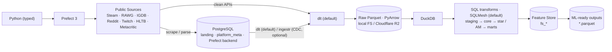

<!-- ru-translation-of: .ai/PLAN.md sha:2cfaff1b84c0 -->
<!-- Автоперевод. Источник — .ai/PLAN.md. Правьте источник, затем /translate-md-docs-to-russian. -->

> 🇬🇧 English original: [PLAN.md](PLAN.md)

# OGIP — План создания

**OGIP · Open Games Intelligence Platform** — сквозная (end-to-end) **платформа рыночной
аналитики (Market Intelligence Platform)**, которая непрерывно собирает публичные данные
игрового рынка, преобразует их в аналитические датасеты и поставляет **ML-ready-результаты**
(включая feature store) для Data Scientists, ML-инженеров и дата-аналитиков.

> Blueprint создания OGIP как **нового проекта по собственному пути** (`~/gi/@dataengy/OGIP`),
> производного от существующего репозитория OGAP (`~/gi/@dataengy/Hushcrasher`), но
> переосмысленного. Кроме заглушек `.ai/` + `docs/` ещё ничего не построено; сборка начинается
> с Фазы 0 только после утверждения этого плана.

- **Часть A — Целевой дизайн** · **Часть B — План создания (по фазам)** · **Часть C — Зафиксированные решения**

---

## 0. Главное, что этот репозиторий должен транслировать

Читатель пролистывает README и дерево репозитория и делает вывод:

> «Этот инженер способен построить **production-платформу данных для стартапа** вроде Hushcrasher.»

**Production-путь остаётся компактным и современным**; всё исследовательское (дополнительные
движки, инструменты feature store, визуализаторы, семантические слои) **изолируется** в
`experimental/` или `docs/comparisons/`, чтобы никогда не засорять production-историю.

---

# ЧАСТЬ A — ЦЕЛЕВОЙ ДИЗАЙН

## A1. Production-архитектура



Production-стек (заявленный технологический стек, полностью подключённый):

| Аспект | Production-выбор OGIP | Примечания |
|---|---|---|
| Язык | **Python 3.13, полностью типизированный** | Pyright strict; Pydantic v2 на границах |
| Оркестрация | **Prefect 3** | ephemeral по умолчанию; профиль server опционален (D3) |
| Метаданные / OLTP / **landing** | **PostgreSQL** | схема **`landing`** для промежуточных scraped/parsed-данных + `platform_meta` (статистика запусков, watermarks, DQ) + backend Prefect-сервера |
| Извлечение | **dlt (по умолчанию)** через семейство `BaseSource`; **ingestr опционально (CDC)** | dlt отвечает за пагинацию/повторы/rate-limits/эволюцию схем; scraped/parsed-данные сначала попадают в Postgres, затем их загружают dlt/ingestr |
| IO озера | **Parquet через PyArrow** | открытый, колоночный, разбиваемый (splittable) |
| Хранилище озера | **локальная ФС (dev по умолчанию) · Cloudflare R2 (основное облако, cloud of record) · MinIO/S3 (профили)** | идентичные кодовые пути S3 (D2) |
| Вычисления | **DuckDB** | in-process OLAP; нативно читает Parquet на ФС/S3; выполняется в CI на каждом PR |
| Движок трансформаций | **SQLMesh (по умолчанию)** — plan/apply, виртуальные окружения, lineage на уровне колонок | питается из `spec/` через компилятор; работает на DuckDB; Prefect выстраивает последовательность слоёв (D5) |
| Продукт | **ML-ready Parquet-датасеты + feature store** | целевые пользователи — DS/ML/DA, не BI |
| Ноутбуки | **JupyterLab** + демо-ноутбуки | основной интерфейс для DS (D7) |
| Наблюдаемость | Grafana + Loki + VictoriaMetrics (опциональный профиль) | лёгкие, single-binary |
| Деплой | **вручную на VPS** (`deploy/vps/`) | **DevOps ведётся отдельно** (здесь вне рамок) |
| CI | **GitHub Actions**: проверка типов (pyright) + тестовый набор (pytest) + pre-commit | warehouse-in-CI дёшев на DuckDB |

## A2. `spec/` — движко-независимая спецификация данных (SSoT)

`spec/` — **слой спецификации, независимый от реализации** — *Open Data Contracts +
переносимая SQL-спецификация*: **датасеты · контракты · схемы · метаданные · SQL · DQ ·
lineage · владение · фичи**.

**Форматы авторинга (D0):**

- **SQL** пишется в **формате Bruin asset** — тело SQL + встроенный YAML `@bruin`
  (`name`, `type` DuckDB-first, `materialization`, `depends`→lineage, `owner`/`tags`→
  метаданные, `columns[].checks`→DQ). Один файл = SQL + lineage + DQ + владение.
- **Контракты источников** в YAML **ODCS** (Open Data Contract Standard) в `spec/contracts/<source>/`.
- Сквозная DQ-политика → `spec/dq/policy.yml`; производный граф → `spec/lineage/`; определения
  фич → `spec/sql/fs/` (с тегом `fs`).

**Компилятор спецификации (`experimental/_gen/` → повышается до `src/ogip/spec_compile/`).**
Поскольку движок — это выбор, небольшой компилятор рендерит ассеты в формате Bruin в
движко-нативные проекты: **модели SQLMesh (рантайм по умолчанию)**, **проект dbt** (профили
dbt · Dagster · SQLMesh-over-dbt) и **Bruin-native** (сквозной проброс, поскольку спецификация
*и есть* Bruin). Раннер plain-SQL также потребляет спецификацию напрямую. Это костяк тезиса
«spec — это SSoT, движок заменяем»: компилятор — единственное место выше `spec/sql/_ext/`,
где живут особенности движков.

> Точный синтаксис Bruin/SQLMesh сверяется с документацией каждого инструмента в момент авторинга (Фаза 1/3).

## A3. Переносимый SQL и сравнения (образовательные, изолированные)

Переносимый SQL с приоритетом DuckDB/Postgres; движко-специфичные переопределения изолированы
в `spec/sql/_ext/<engine>/`. В `docs/comparisons/` живут изолированные, исключительно
образовательные исследования — они никогда не усложняют production:

| Документ | Охват |
|---|---|
| `dbt-vs-sqlmesh.md` · `dbt-vs-bruin.md` · `sqlmesh-vs-bruin.md` · `plain-sql-vs-frameworks.md` | архитектура · плюсы · минусы · зрелость · переносимость · CI · lineage · тестирование · документация · сложность миграции · знакомость при найме → вердикт для OGIP (по умолчанию = SQLMesh) |
| `iceberg-vs-ducklake.md` | архитектура · метаданные · снапшоты · объектное хранилище · конкурентность · обслуживание · масштабирование · зрелость OSS; почему сейчас Parquet, когда мигрировать |
| `dlt-vs-ingestr.md` | кастомные API · скрейпинг · REST · инкрементальность · эволюция схем · повторы · rate limiting · враждебные API · гибкость Python · зрелость · **CDC** (см. A6); рекомендация для OGIP |
| `feature-store-tools.md` | **анализ целесообразности внедрения** — SQL-как-feature-store против специализированных FS-инструментов (Feast/Featureform/Hopsworks): online-выдача, корректность point-in-time, шаринг фич; вердикт для OGIP (D6) |
| `visualizers-evidence.md` | **анализ целесообразности внедрения** — Evidence (и Metabase/Superset) как опциональный визуализатор для DA/DS/MLE поверх результатов (D8) |
| `secrets-management.md` | **анализ целесообразности внедрения** — минимальный вариант по умолчанию (gitignored `.env` + секреты GitHub Actions) и более тяжёлые opt-in-альтернативы (Bitwarden CLI, git-secret/GPG) (D10, A13) |
| `modeling-techniques.md` | **сравнение** — 3NF · частичный Data Vault · звезда Кимбалла · **Activity Schema** (слой AM): когда что подходит, компромиссы, как OGIP использует все четыре (D13, A5) |

## A4. Что OGIP держит опциональным / вне основного пути

| Элемент | Размещение |
|---|---|
| Airbyte как основная инжестия | упомянут в `dlt-vs-ingestr.md`; без runtime-зависимости |
| **Evidence** (визуализатор) | **опциональный исследовательский** трек `experimental/bi/evidence/` для DA/DS/MLE (D8) |
| MetricFlow / Cube (семантика) | `experimental/semantic/` (опциональные демо) |
| Универсальный семантический слой / плагинная архитектура | убраны из prod; фреймворки живут в `experimental/`, потребляют `spec/` |
| Специализированный feature-store-инструмент (Feast/Featureform) | **анализ + опциональное демо** `experimental/features/`; prod-FS — это SQL-as-FS (A5, D6) |
| BI-first-архитектура | убрана — продукт это ML-ready-датасеты + feature store |

**Откаты относительно OGAP:** DuckLake/Iceberg по умолчанию → **Parquet (R2)**; dbt как
движок по умолчанию → **SQLMesh**; семантический + BI-слои → **ML-результаты + feature store**.

## A5. Слои данных — классический EDW, **без «медальонной» терминологии**

| # | Слой | Схема / префикс | Контракт |
|---|---|---|---|
| **0** | **RAW** | `<system>__<table>` (`steam__appdetails`, `reddit__posts`) | **1:1 AS-IS**-захват источника — никаких преобразований вообще; иммутабельный Parquet; **единственные** колонки, которые можно добавить, — опциональная метка времени `_ingested_at` и/или `etl_batch_id`. Производится **инжестией** (A6), а не движком трансформаций. |
| 1 | **STAGING** | `stg_*` | типизация, snake_case, UTC, дедупликация — **никакой бизнес-логики** |
| 2 | **CORE** | сущности + мосты (`game`, `publisher`, `genre`, `game_genre`, …) | интегрированная 3NF; частичный Data Vault только для кросс-источниковой идентичности `game` |
| 3 | **STAR** | `*_fact` / `*_dim` | звезда Кимбалла, материализованные таблицы |
| 4 | **AM** | `am_<entity>_stream` (`am_game_stream`) | **Activity Model** (D13): временной **поток активностей** по [Activity Schema](https://www.activityschema.com/) — одна строка на активность (`entity_id`, `ts`, `activity`, фичи, `activity_occurrence`, `activity_repeated_at`); строится из CORE/STAR; датасеты выводятся через темпоральные join'ы |
| 5 | **MARTS** | `owt_*` (широкие) / `agg_*` (агрегаты) | денормализованные аналитические таблицы (потребляют STAR и/или AM) |
| 6 | **FS** | `fs_<entity>_<feature_group>` | **Слой Feature Store** (D6): point-in-time-фиды фич → ML-ready Parquet |

Слой 0 (RAW) — иммутабельная посадка каждой таблицы источника «как есть»; движок
трансформаций её потребляет, но никогда не пишет. **AM (Activity Model)** и **STAR** —
взаимодополняющие аналитические слои над CORE — dims/facts по Кимбаллу *и* поток активностей
Activity Schema — демонстрирующие обе техники (наряду с частичным Data Vault в CORE); оба
питают MARTS/FS. **Слой FS** — ML-продуктовая поверхность, материализуемая как SQL-модели
(SQLMesh) → Parquet. По умолчанию это *SQL-как-feature-store* (без фреймворка); внедрение
специализированного FS-инструмента — проанализированная опция
(`docs/comparisons/feature-store-tools.md`, `experimental/features/`).

**Движок трансформаций (A1, D5):** **SQLMesh**, компилируемый из `spec/`, работающий на DuckDB.
Prefect выстраивает последовательность слоёв (`plan`/`apply` на окружение); SQLMesh отвечает
за порядок внутри DAG, lineage на уровне колонок и аудиты. Раннер plain-SQL, dbt и
Bruin-native — запускаемые движки для сравнения в `experimental/` (A9, D1).

## A6. Инжестия — dlt по умолчанию, landing-зона в Postgres, ingestr опционально (D11)

```
ingestion/
  base/  base_source.py  api_source.py  scraper_source.py  incremental_source.py
  common/  http.py  throttle.py  cache.py  watermark.py
  sources/ steam.py steam_reviews.py rawg.py igdb.py reddit.py twitch.py metacritic.py hltb.py
```

**dlt — движок инжестии по умолчанию.** Семейство `BaseSource` — эргономичный слой OGIP,
производящий dlt-ресурсы/пайплайны, поэтому каждый источник остаётся небольшим, демонстрируя
при этом **пагинацию · повторы · rate limits · инкрементальную синхронизацию · watermark · кэш · обработку ошибок**.

**Два паттерна инжестии:**

1. **Прямой (чистые API)** — `ApiSource`/`IncrementalSource` → **dlt** → сырой Parquet.
2. **Через landing (scraped / parsed / «грязные» данные)** — `ScraperSource` + парсеры пишут в
   **схему `landing` в PostgreSQL** (долговечное, запрашиваемое, дедуплицируемое промежуточное
   хранилище); затем **dlt (по умолчанию)** — или **ingestr (опционально, CDC)** — загружает
   из Postgres → сырой Parquet.

Персистенция scraped/parsed-данных сначала в Postgres делает повторы и переобработку дешёвыми
и даёт шагу загрузки чистый типизированный источник. Порядок сборки (сначала быстрый срез D4):
**Steam → RAWG** (API, dlt-напрямую), затем Steam Reviews, IGDB, Reddit, Twitch (API), HLTB,
Metacritic (скрейперы → landing).

Конкурентность скрейперов, «вежливость» (politeness), устойчивость и гарантии доставки
зафиксированы в [ADR-0014](../docs/adr/ADR-0014-resilient-scraping-concurrency.md):
async-first-выборка с ограниченной конкурентностью на домен, at-least-once-выборка +
идемпотентный upsert в landing (= фактически effectively-once), DLQ + watermarks для
повтора/возобновления и opt-in пул процессов только для CPU-bound-парсинга.

**ingestr и CDC (опционально).** `ingestr` — опциональный загрузчик для **Change Data Capture**
(<https://getbruin.com/docs/ingestr/getting-started/cdc.html>) — заранее согласованный путь
на случай, когда landing-зоне Postgres (или будущему OLTP-источнику) нужен инкрементальный
CDC вместо батч-загрузок. Компромиссы — в `dlt-vs-ingestr.md`.

## A7. Результаты — ML-ready-датасеты + feature store (продукт)

Материализуются в Parquet в `.run/outputs/`, задокументированы в `docs/DATASETS.md`:

| Результат | Слой | Грануляция |
|---|---|---|
| `games.parquet` · `publishers.parquet` · `reviews.parquet` | marts / экспорты core | сущность / отзыв |
| `market_features.parquet` · `genre_features.parquet` · `trend_features.parquet` | **FS** | game×snapshot · genre×period · entity×time |

**Интерфейсы для DS:** демо-ноутбуки `notebooks/` (JupyterLab, D7) — основные;
`examples/load_datasets.py` показывает программную загрузку; **Evidence** — опциональный
локальный визуализатор (D8).

## A8. Качество данных

Определяется в `spec/` (Bruin `checks` + `spec/dq/policy.yml` + SLA ODCS), исполняется тонким
раннером `dq/` (аудиты SQLMesh, где это естественно): **контракты · ассерты · свежесть ·
уникальность · ссылочная целостность · бизнес-правила**. Результаты аудируются в
`platform_meta.dq_results` (Postgres). Серьёзность: `error` блокирует; `warn` записывает + алертит.

## A9. Опциональное / экспериментальное (вне production-пути)

```
experimental/
  engines/        # plain_sql · dbt · bruin — runnable, consume spec/ (SQLMesh is prod, not here)
  orchestration/  # complete alternative setups: prefect_bruin · prefect_dbt ·
                  #   prefect_sqlmesh_over_dbt · prefect_dagster_dlt_dbt (A12)
  semantic/       # metricflow · cube demos
  bi/evidence/    # optional visualizer for DA/DS/MLE (D8)
  features/       # dedicated feature-store-tool demo (Feast/Featureform) (D6)
  _gen/           # spec compiler (→ src/ogip/spec_compile) — keeps spec the SSoT
```

Ничто из `experimental/` не импортируется `src/`, `pipelines/`, `transform/` или дефолтными
`make`-таргетами.

## A10. Наблюдаемость, CI, деплой, конфигурация

- **Наблюдаемость**: JSON-логи loguru; Protocol `Notifier` (абстракция алертов); метрики →
  VictoriaMetrics; логи → Loki через Alloy; один дашборд Grafana; опциональный `make obs-up`.
  Метаданные запусков в Postgres `platform_meta`.
- **CI (GitHub Actions)**: **проверка типов (pyright strict) + тестовый набор (pytest)** +
  pre-commit (ruff, sql lint, yaml lint) поверх общей библиотеки `.ci/steps/`.
- **Деплой**: **вручную на VPS** — в `deploy/vps/` лежит ранбук ручного деплоя + вспомогательные
  скрипты (uv sync, рендер env, prefect deploy, compose up). **DevOps/инфраструктура ведётся
  отдельно** и вне рамок этого репозитория.
- **SSoT конфигурации**: `config/config.yml` объявляет каждый несекретный дефолт один раз;
  `config/.env-render.py` рендерит производный `.env` с пустыми слотами секретов (заполняются
  вручную или в CI из секретов GitHub Actions; A13); шаблоны содержат только пустые слоты /
  имена env-переменных.

## A11. Целевая структура репозитория

```
OGIP/
├── README.md  LICENSE  Makefile  Justfile  pyproject.toml  .python-version  .gitignore
├── AGENTS.md -> .ai/AGENTS.md
├── src/ogip/            # typed core: config, logger, warehouse(DuckDB), metrics, notify, spec_compile
├── ingestion/           # base/ + common/ + sources/ (A6; dlt default, Postgres landing)
├── integrations/        # github/ (task sync → Issues/Projects, A14) · prefect/ (deploy + trigger jobs: CLI/API/MCP)
├── spec/                # SSoT: datasets/ contracts/(ODCS) schemas/ sql/(Bruin) dq/ lineage/  (sql/fs = features)
├── transform/           # SQLMesh project wiring + runner (A5)  ·  plain-sql runner (comparison)
├── dq/                  # DQ executor over spec/dq (A8)
├── pipelines/           # Prefect flows + deployments (A1)
├── outputs/  examples/  notebooks/   # ML-ready parquet catalog · usage script · Jupyter demos (D7)
├── deploy/              # docker-compose (core: postgres) + obs/ + storage/ + prefect-server/ + vps/
├── config/              # config.yml (SSoT), .env-render.py, templates, linters (+ opt-in .env-secrets-render.sh, secrets/ for Bitwarden/git-secret)
├── docs/                # architecture/ · adr/ · runbooks/ · comparisons/ · ROADMAP · DATASETS · CHANGELOG
├── experimental/        # engines/ · orchestration/ · semantic/ · bi/evidence · features/ · _gen/ (A9)
├── .ci/{run.sh,steps/}  .github/workflows/ci.yml
├── .ai/                 # AGENTS · CLAUDE · README · STATUS · PLAN · TODO · tasks/
├── .run/                # ALL runtime: venv, caches, DuckDB warehouse, outputs — gitignored
└── .tmp/                # ALL temp scripts & other temp files (gitignored) + tracked README + Justfile;
                         #   .once/ one-shots; graduate durable ones → integrations/ · skills · src/
```

## A12. Профили запуска и оркестрации

Выбираются через `config/config.yml → run_profiles` + `just run-profile <name>`. По умолчанию =
production; остальные — **запускаемые** (D1), все потребляют один и тот же `spec/` (проекты
dbt/SQLMesh/Bruin **генерируются** компилятором).

**Профили «оркестрация × движок»:**

| Профиль | Оркестратор | Инжестия | Трансформация | Путь |
|---|---|---|---|---|
| `prefect-sqlmesh` *(по умолчанию)* | Prefect 3 | **dlt** (через `BaseSource`) | **SQLMesh** на DuckDB (из спецификации) | **production** |
| `prefect-sql` | Prefect 3 | dlt | раннер plain-SQL на DuckDB | сравнение |
| `prefect-bruin` | Prefect 3 | dlt | **Bruin** выполняет `spec/sql` нативно | **полный альтернативный setup** |
| `prefect-dbt` | Prefect 3 | dlt | dbt (сгенерированный проект) | сравнение |
| `prefect-sqlmesh-over-dbt` | Prefect 3 | dlt | SQLMesh поверх сгенерированного dbt-проекта | сравнение |
| `prefect-dagster-dlt-dbt` | Prefect → **Dagster** | dlt (ассеты Dagster) | dbt (dbt-интеграция Dagster) | **полный альтернативный setup** |

`prefect-bruin` и `prefect-dagster-dlt-dbt` — **полные, запускаемые альтернативные стеки**
(инжестия + трансформация + оркестрация), а не частичные демо.

**Инжестия (D11):** dlt по умолчанию — напрямую для чистых API, из схемы `landing` Postgres
для scraped/parsed-данных; **ingestr** опционально для CDC из landing-зоны.
**Хранилище (D2):** `local` *(по умолчанию)* · `r2` (Cloudflare, основное облако) · `minio` · `s3`.
**Рантайм Prefect (D3):** `ephemeral` *(по умолчанию)* · `server` (+ Postgres в compose).

## A13. Управление секретами — минимально и максимально легко (D10)

Самый лёгкий стек, который держит секреты вне git и работает в CI, **без vault-демона, без
GPG, без внешнего аккаунта** на пути по умолчанию:

- **Локально + VPS:** **gitignored `.env`**. *Имена* слотов объявляются один раз в
  `config/config.yml` (SSoT); `config/.env-render.py` пишет производный `.env` с **пустыми
  слотами секретов**, которые вы заполняете вручную. Нечего запускать, нет зависимостей.
- **CI/CD:** **зашифрованные секреты GitHub Actions** → env-переменные workflow (те же имена
  слотов). Нативно для CI, который мы уже используем; ноль дополнительного инструментария.

Это весь вариант по умолчанию. Отслеживаемые шаблоны содержат только пустые слоты / имена
env-переменных; отрендеренный `.env` всегда в gitignore; ключи никогда не попадают в сырые датасеты.

**Opt-in более тяжёлые бэкенды** (задокументированы в `docs/comparisons/secrets-management.md`,
выключены по умолчанию): **Bitwarden CLI** через `config/.env-secrets-render.sh` для
синхронизируемого хранилища; **git-secret** (GPG) для версионирования зашифрованных секретов
внутри репозитория. Выбирается через
`config/config.yml → secrets.backend` (`env` по умолчанию · `github` в CI · `bitwarden`/`git-secret` opt-in).

## A14. Трекинг задач и синхронизация с GitHub (D12)

Три артефакта, один источник истины:

- **`.ai/TODO.md`** — короткие, **упорядоченные, с чекбоксами** ближайшие действия; каждый пункт
  ссылается на файл задачи и/или фазу (например, `- [ ] scaffold pyproject → .ai/tasks/phase-0-scaffold.md`).
- **`.ai/tasks/`** — детальные файлы задач по фазам / разовые (чек-листы, заметки, критерии приёмки).
- **GitHub Issues + доска GitHub Project** — трекер, которым можно делиться. `just tasks-sync`
  пушит `.ai/tasks/*` → Issues (идемпотентно, по стабильному slug), добавляет их в Project и
  записывает номер issue обратно в файл задачи (обратная ссылка). Статус можно подтягивать
  обратно для обновления `TODO.md`.

`integrations/github/` содержит клиент синхронизации (использует `gh` CLI / GitHub API; токен
через бэкенд секретов, A13). GitHub Issues/Projects — **единственный трекер задач** OGIP
(виден в портфолио); `TODO.md`/`tasks/` — локальное рабочее зеркало.

---

# ЧАСТЬ B — ПЛАН СОЗДАНИЯ (по фазам, с воротами утверждения)

Планка качества на каждой фазе: Ruff чист · Pyright strict 0 ошибок · pytest зелёный (`make check` = CI).

## Стратегия поставки — сначала walking skeleton (D14)

Построить **тонкий вертикальный срез end-to-end до расширения вширь**. Фазы ниже (0–10)
определяют *целевую широту*; *порядок поставки* управляется вехами:

- **M0 — walking skeleton (минимальный полный пайплайн).** Один источник → **сырой Parquet** →
  spec-first (написать 1-й контракт ODCS + 1-е SQL-модели в формате Bruin) → **SQLMesh** собирает
  минимальный `staging → core → mart/fs` → один **ML-результат `*.parquet`** → один
  **Jupyter-ноутбук** + одна страница **Evidence**. Оркестрируется **Prefect**-flow; инжестия
  через **dlt** (ingestr там, где CDC). *Рекомендуемый первый источник: RAWG* (чистый
  документированный REST — минимум трения). Компилятор спецификации начинается как тонкая
  прослойка (Bruin→SQLMesh), развиваемая позже.
- **M1–M4 — тиражировать тот же срез на другие тулсеты** (полные альтернативные setup'ы):
  `prefect-bruin`, `prefect-dbt`, `prefect-sqlmesh-over-dbt`, `prefect-dagster-dlt-dbt` — тот же
  срез «источник→результат», другой движок/оркестратор, все потребляют один и тот же `spec/`.
- **Затем расширяться** — больше источников, глубина `star`/`am`/`fs`, DQ, наблюдаемость (Фазы 4–10).

**Репроприоритизация — 2026-07-17.** С отгруженным M0 ближайший порядок меняется (SWOT
против брифа целевого use-case): **P1a — устойчивый срез скрейпинга** (`ScraperSource`
по [ADR-0014](../docs/adr/ADR-0014-resilient-scraping-concurrency.md) + landing в Postgres
+ HLTB end-to-end → `tasks/scraping-resilient.md`, lane `ingestion`) и **P1b — финализация
R2 + деплоя на VPS** (`tasks/r2-vps-finalize.md`, все оставшиеся пункты в lane
`core-pipeline`) идут **до** тиражирования тулсетов M1–M4. Новые источники прорабатываются как
P2-бэклог, привязанный к потребностям рыночной модели (`tasks/sources-backlog.md`). Неизвестные
в требованиях, питающие эти решения, отслеживаются в
[docs/OPEN-QUESTIONS.md](../docs/OPEN-QUESTIONS.md).

**Ритуал «запускай после каждой имплементации» (D14).** После каждой вехи/изменения кода:
поднять все нужные сервисы в **Docker** (`make up` — Postgres + Prefect + MinIO по
необходимости) и **прогнать Prefect-задачу** end-to-end (деплой `integrations/prefect/` +
триггер через Prefect CLI/API; MCP, если доступен). Срез не «готов», пока его Prefect-запуск
не зелёный в Docker.

Фаза 0 (scaffold) по-прежнему первая — M0 стягивает минимальные куски Фаз 1–7 в одну работающую нить.

### Механика создания (до Фазы 0)

Свежий `git init` в `~/gi/@dataengy/OGIP` (чистая портфолио-история); **кураторский перенос,
а не копия** проверенных ассетов OGAP; никогда не переносить `.venv/`, `.run/`, кэши движков,
`.stash/`, `.tmp/`, `uv.lock` (перегенерировать) или секреты. OGAP остаётся нетронутым
соседним репозиторием.

**Карта переноса (OGAP → OGIP):** `src/ogap/*`→`src/ogip/`; `ingestion/dlt/*`→`ingestion/sources/`
(на `BaseSource`); `spec/*`→`spec/` (SQL→формат Bruin, контракты→ODCS);
`dwh/dq/*`→`dq/`; `dwh/engines/{sqlmesh,sqlmesh_dbt,dbt,bruin}`→`transform/` (SQLMesh prod) +
`experimental/engines`; `orchestr/{prefect,dagster}`→`pipelines/`+`experimental/orchestration/`;
`deploy/*`→`deploy/` (+ vps/, storage/, prefect-server/); `.ci/`,`.github/`→туда же;
`config/*`→`config/` (+ run_profiles); `bi/evidence`→`experimental/bi/evidence`;
`docs/*`→переписываются; `Makefile`/`Justfile`→урезаются + `run-profile`/`notebook`.

### Фазы

- **Фаза 0 — Scaffold и идентичность.** git init; `pyproject.toml` (`ogip`, py3.13, uv;
  зависимости: prefect, duckdb, pyarrow, httpx, tenacity, pydantic, loguru, sqlmesh; **группы
  dev/notebook: jupyterlab, ruff, pyright, pytest**); pre-commit; тонкие `Makefile`/`Justfile`;
  `config/config.yml` (SSoT, включая `run_profiles`, `secrets.backend=env`) + `.env-render.py`
  (пустые слоты секретов) + шаблоны + `.gitignore` для отрендеренного `.env` (секреты GitHub
  Actions в CI; opt-in `.env-secrets-render.sh` для Bitwarden/git-secret); `src/ogip/{__init__,config,
  logger}.py`; `.ci/` + GitHub Actions; корневые
  симлинки; `.ai/TODO.md` + синхронизация задач `integrations/github/` (`just tasks-sync`, A14);
  `.run/` (в gitignore) + `.tmp/` (README + Justfile, в gitignore). **Приёмка**: `make check` + CI
  зелёные; `make render-env` + secrets-render производят полный `.env`; `just tasks-sync --dry-run`
  перечисляет issues, которые он создал бы.
- **Фаза 1 — SSoT `spec/`.** реестр датасетов; контракты ODCS; `spec/sql/
  {staging,core,star,marts,fs}/` в формате Bruin; `spec/dq/policy.yml`; `spec/lineage/`.
  **Приёмка**: спецификация валидируется; lineage строится; для чтения спецификации не нужен
  бинарь движка.
- **Фаза 2 — Инжестия (dlt по умолчанию) + Steam/RAWG.** `ingestion/base/`+`common/`,
  производящие **dlt**-пайплайны; **схема `landing` в PostgreSQL** для промежуточных
  scraped/parsed-данных (dlt/ingestr читают из неё); Steam + RAWG (API, dlt-напрямую) → сырой
  Parquet; встроенные фикстуры (без ключей). **Приёмка**: демо сырого parquet из фикстур;
  round-trip через landing в Postgres; тесты на каждый источник.
- **Фаза 3 — Трансформация (SQLMesh по умолчанию).** `src/ogip/spec_compile/` (spec→SQLMesh);
  SQLMesh-проект `transform/`; сборка `staging→core→{star, am}→marts→fs` на DuckDB (AM = поток
  Activity Schema, D13). **Приёмка**: полный DAG собирается на sample-данных локально + в CI;
  доступен lineage по колонкам.
- **Фаза 4 — Качество данных.** исполнитель `dq/` (Bruin checks + SLA ODCS + аудиты SQLMesh);
  модель серьёзности; `platform_meta.dq_results`. **Приёмка**: проверка с `error` блокирует flow.
- **Фаза 5 — ML-ready-результаты + ноутбуки (D7).** FS + marts → шесть `*.parquet`;
  `docs/DATASETS.md`; `examples/load_datasets.py`; демо-ноутбуки `notebooks/` (загрузка, EDA,
  исследование фич). **Приёмка**: результаты материализуются; `make notebook` открывает
  JupyterLab; демо работают.
- **Фаза 6 — Оркестрация (Prefect) + Postgres.** `pipelines/flows/`:
  `ingest → transform → dq → publish_outputs`; ежедневный драйвер; идемпотентность;
  `platform_meta` в Postgres; профили Prefect `ephemeral`+`server` (D3). **Приёмка**: `make run` end-to-end.
- **Фаза 7 — Наблюдаемость.** логирование; метрики→VictoriaMetrics; Loki+Alloy; Grafana;
  `Notifier`; `deploy/obs/`. **Приёмка**: `make obs-up` показывает метрики пайплайна.
- **Фаза 8 — Оставшиеся источники + облачное хранилище.** Steam Reviews, IGDB, Reddit, Twitch
  (API); HLTB, Metacritic (**скрейперы → Postgres `landing` → dlt**); contracts-first; профили
  хранилища `r2`/`minio`/`s3` (D2); опциональный **ingestr CDC** из landing-зоны. **Приёмка**:
  фикстуры + тесты на источник; round-trip R2/MinIO; загрузка landing→озеро проверена; DAG зелёный.
- **Фаза 9 — Сравнения + полные альтернативные setup'ы + исследования (D1/D6/D8/D11).**
  компилятор → dbt/Bruin; запускаемые `experimental/engines/{plain_sql,dbt,bruin}` + **полные
  альтернативные setup'ы** `orchestration/{prefect_bruin, prefect_dagster_dlt_dbt}` (плюс
  `prefect_dbt`, `prefect_sqlmesh_over_dbt`); подключён `just run-profile`; заполнить
  `docs/comparisons/*`, включая **feature-store-tools** (+ `experimental/features/`) и
  **visualizers-evidence** (+ `experimental/bi/evidence/`). **Приёмка**: каждый профиль
  прогоняет полный sample-DAG end-to-end; документация полная; `experimental/` не импортируется
  ничем на prod-пути.
- **Фаза 10 — Деплой на VPS + README + полировка.** `deploy/vps/` — ранбук ручного деплоя +
  скрипты (uv sync, рендер env, **секреты через Bitwarden/git-secret на VPS**, prefect deploy,
  compose up; DevOps отдельно); `README.md` в стиле «сначала результат» (диаграмма A1);
  структурный guard; аудит закона именования + SSoT + гигиены секретов. **Приёмка**: README
  business-first; ранбук деплоя полон; `make check` + CI зелёные.

---

# ЧАСТЬ C — ЗАФИКСИРОВАННЫЕ РЕШЕНИЯ И ДОПУЩЕНИЯ

| # | Решение |
|---|---|
| D0 | `spec/sql` в **формате Bruin asset**; прочие сущности спецификации в Bruin, где возможно; контракты в **ODCS**. Bruin = открытая сериализация авторинга, а не prod-зависимость. |
| D1 | Профили dbt/SQLMesh/Bruin + оркестрации — **запускаемые** демо в `experimental/`. |
| D2 | Хранилище: **локальная ФС по умолчанию** + **Cloudflare R2** (основное облако) + профили **MinIO** + **S3**. |
| D3 | Prefect — **оба варианта**: ephemeral (по умолчанию) + профиль server-in-compose. |
| D4 | Быстрый срез: Фазы 0–6 на **Steam + RAWG** → демо end-to-end. |
| D5 | **Движок трансформаций по умолчанию = SQLMesh** (из спецификации, на DuckDB, оркестрируется Prefect). Раннер plain-SQL + dbt + Bruin = профили для сравнения. Требуется компилятор спецификации. |
| D6 | Добавить **слой FS (Feature Store)** `fs_*` (SQL-as-FS → parquet) + **анализ целесообразности** специализированного FS-инструмента (Feast/Featureform) как research/опцию. |
| D7 | **JupyterLab** в настройке проекта + демо-ноутбуки `notebooks/` (основной DS-интерфейс). |
| D8 | **Evidence** как **опциональный** исследовательский трек визуализатора для DA/DS/MLE (`experimental/bi/evidence/` + аналитический документ). |
| D9 | Подключён полный заявленный **стек**: типизированный Python · uv · Prefect 3 · **PostgreSQL** (landing-зона + метаданные платформы + backend Prefect) · **Cloudflare R2** · **Parquet/PyArrow** · DuckDB · **ручной деплой на VPS** (DevOps отдельно) · GitHub Actions (typecheck + тесты). |
| D10 | **Секреты = минимально и максимально легко** (A13): gitignored **`.env`** (слоты из SSoT) локально + на VPS, **секреты GitHub Actions** в CI. Без vault/GPG по умолчанию; **Bitwarden CLI** и **git-secret** — opt-in (задокументировано). |
| D11 | **Инжестия: dlt по умолчанию** (через `BaseSource`); **ingestr опционально для CDC**. Scraped/parsed/промежуточные данные попадают в **PostgreSQL** (схема `landing`); dlt/ingestr читают из неё в сырой Parquet. |
| D12 | **Трекинг задач = GitHub Issues/Projects** (A14): `.ai/tasks/` ↔ Issues/доска Project через `just tasks-sync`; `.ai/TODO.md` — короткий упорядоченный чек-лист со ссылками на задачи. |
| D13 | **Добавить слой AM (Activity Model)** — [Activity Schema](https://www.activityschema.com/) `am_<entity>_stream`; дополняет STAR Кимбалла над CORE. Демонстрируются четыре техники моделирования (3NF · Data Vault · Kimball · Activity Schema). |
| D14 | **Поставка = сначала walking skeleton** — минимальный полный срез (1 источник → raw → spec → SQLMesh → ML parquet → ноутбук + Evidence, на Prefect+dlt), затем тиражирование на тулсеты; **запуск в Docker + Prefect после каждой имплементации** (`integrations/prefect/`). |
| + | Полные запускаемые альтернативные setup'ы **Prefect+Bruin** и **Prefect+Dagster-over-dlt/dbt** (A12); **CDC через ingestr** из landing-зоны Postgres (опционально). |

**Допущения (сигнализируйте, если менять):** свежий `git init` (без истории OGAP) · OGAP
остаётся соседним репозиторием · GitHub Actions — единственный обязательный CI · пакет `ogip` ·
та же планка качества, что и в OGAP.

**Открытая проектная заметка:** D0 (авторинг в Bruin) + D5 (запуск на SQLMesh) подразумевает
шаг компиляции спецификации. Если вы предпочитаете авторить нативно в SQLMesh и убрать шаг
компиляции, это упрощает prod-путь, но ослабляет историю о заменяемости движка — помечено для
вашего решения.

---

## Следующий шаг

По утверждении — преобразовать в имплементационный план (writing-plans) и начать **Фазу 0 —
Scaffold и идентичность**, останавливаясь на воротах каждой фазы.
