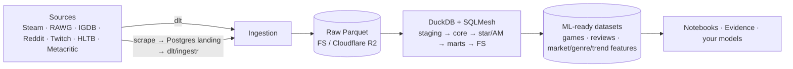

# OGIP — Open Games Intelligence Platform

> A **Market Intelligence Platform** for the games industry: it continuously collects public
> gaming-market data, transforms it with SQL on DuckDB, and ships **ML-ready Parquet datasets**
> for **Data Scientists, ML Engineers, and Analysts**.

[](.github/workflows)
[](pyproject.toml)
[](pyproject.toml)
[](LICENSE)

## What it does



The production path is intentionally lean: **Python → Prefect → dlt → Parquet → DuckDB →
SQLMesh → ML-ready outputs.** Every alternative (dbt, Bruin, Dagster, semantic layers, BI) is
a runnable *comparison* under [`experimental/`](experimental/) or a research doc under
[`docs/comparisons/`](docs/comparisons/) — never on the production path.

## Quickstart

```bash
make bootstrap    # uv → .run/venv, pre-commit (prek) hooks, render .env from config/config.yml
make check        # ruff + pyright strict + pytest (CI parity)
make up           # Postgres + Prefect in Docker
make run          # run the pipeline on sample data → .run/outputs/*.parquet
make notebook     # open JupyterLab on the ML-ready datasets
```

Requirements: [uv](https://docs.astral.sh/uv/), Docker Compose. Optional: [just](https://just.systems/).

## How it's built

- **Layers (classical EDW, no medallion):** `raw <system>__<table>` → `stg_*` → `core` →
  `*_fact/*_dim` → `am_<entity>_stream` ([Activity Schema](https://www.activityschema.com/)) →
  `owt_*/agg_*` → `fs_*`. See [docs/architecture/overview.md](docs/architecture/overview.md).
- **`spec/` is the SSoT** — portable SQL in Bruin format + ODCS contracts; the engine is a
  config choice (default **SQLMesh**), compiled from spec. See [ADRs](docs/adr/).
- **Product = ML-ready datasets** for DS/ML/Analysts — not BI.

Plan & status: [.ai/PLAN.md](.ai/PLAN.md) · [.ai/STATUS.md](.ai/STATUS.md). Agents start at
[AGENTS.md](AGENTS.md). Roadmap: [docs/ROADMAP.md](docs/ROADMAP.md).

## License

[MIT](LICENSE)
