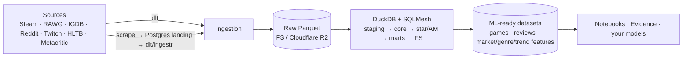

<!-- ru-translation-of: README.md sha:efabe516cc9d -->
<!-- Автоперевод. Источник — README.md. Правьте источник, затем /translate-md-docs-to-russian. -->

> 🇬🇧 English original: [README.md](README.md)

# OGIP — Open Games Intelligence Platform

> **Платформа рыночной аналитики** (Market Intelligence Platform) для игровой индустрии:
> непрерывно собирает публичные данные игрового рынка, преобразует их с помощью SQL на DuckDB
> и поставляет **готовые для ML датасеты в формате Parquet** для **дата-сайентистов,
> ML-инженеров и аналитиков**.

[](.github/workflows)
[](pyproject.toml)
[](pyproject.toml)
[](LICENSE)

## Что это делает



Продакшн-путь намеренно минималистичен: **Python → Prefect → dlt → Parquet → DuckDB →
SQLMesh → готовые для ML выходные данные.** Любая альтернатива (dbt, Bruin, Dagster,
семантические слои, BI) — это запускаемое *сравнение* в каталоге
[`experimental/`](experimental/) или исследовательский документ в
[`docs/comparisons/`](docs/comparisons/), но никогда не часть продакшн-пути.

## Быстрый старт

```bash
make bootstrap    # uv → .run/venv, pre-commit (prek) hooks, render .env from config/config.yml
make check        # ruff + pyright strict + pytest (CI parity)
make up           # Postgres + Prefect in Docker
make run          # run the pipeline on sample data → .run/outputs/*.parquet
make notebook     # open JupyterLab on the ML-ready datasets
```

Требования: [uv](https://docs.astral.sh/uv/), Docker Compose. Опционально: [just](https://just.systems/).

## Как это устроено

- **Слои (классический EDW, без medallion):** `raw <system>__<table>` → `stg_*` → `core` →
  `*_fact/*_dim` → `am_<entity>_stream` ([Activity Schema](https://www.activityschema.com/)) →
  `owt_*/agg_*` → `fs_*`. См. [docs/architecture/overview.md](docs/architecture/overview.md).
- **`spec/` — это SSoT** — переносимый SQL в формате Bruin + контракты ODCS; движок
  является выбором конфигурации (по умолчанию **SQLMesh**), компилируется из spec.
  См. [ADR](docs/adr/).
- **Продукт = готовые для ML датасеты** для DS/ML/аналитиков — не BI.

План и статус: [.ai/PLAN.md](.ai/PLAN.md) · [.ai/STATUS.md](.ai/STATUS.md). Агенты начинают с
[AGENTS.md](AGENTS.md). Дорожная карта: [docs/ROADMAP.md](docs/ROADMAP.md).

## Лицензия

[MIT](LICENSE)
