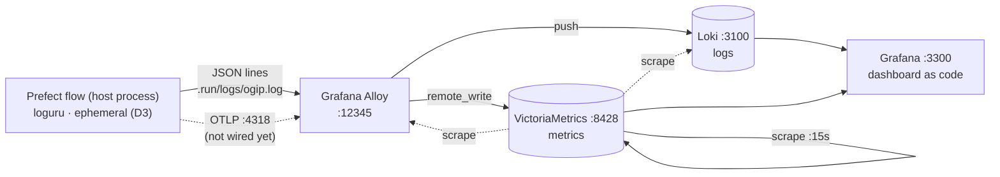

# OGIP — Observability

How the platform is observed: **logs → Loki**, **metrics → VictoriaMetrics**, both collected by
**Grafana Alloy** and read through **one provisioned Grafana dashboard**. Lightweight by design
([`.ai/PLAN.md`](../../.ai/PLAN.md) A10) — single binaries, no Kubernetes, no cluster mode.

The stack is **optional**: the production pipeline runs green without it. Start it with
`make obs-up`, stop it with `make obs-down`. Files: [`deploy/obs/`](../../deploy/obs/).

## Topology



The pipeline is a **short-lived host process**, not a container — so metrics are **pushed**
(OTLP → Alloy → remote-write), never scraped. Scraping is reserved for the stack's own health
([`deploy/obs/victoriametrics/scrape.yml`](../../deploy/obs/victoriametrics/scrape.yml)).

## Components

| Component | Port | Role | Config |
|---|---|---|---|
| VictoriaMetrics | 8428 | metrics store (Prometheus-compatible), 30d retention | [`scrape.yml`](../../deploy/obs/victoriametrics/scrape.yml) |
| Loki | 3100 | log store (single binary, filesystem) | image default (`local-config.yaml`) |
| Alloy | 12345 · 4317/4318 | collector: tails logs → Loki; OTLP in → VictoriaMetrics | [`config.alloy`](../../deploy/obs/alloy/config.alloy) |
| Grafana | 3300 | dashboards + datasources, provisioned from disk | [`provisioning/`](../../deploy/obs/grafana/provisioning/) |

Grafana is anonymous-viewer by default (local demo); admin is `admin`/`admin` unless
`GRAFANA_ADMIN_USER` / `GRAFANA_ADMIN_PASSWORD` are set in `.env`.

## Logging contract

`src/ogip/logger.py` wraps **loguru**. With `json_logs=True` it emits one JSON object per line
(loguru's `serialize=True` envelope), and bound context (`source`, `entity`, `flow_run_id`)
rides in `record.extra` — which is exactly what Alloy parses:

| JSON path | Becomes | Why |
|---|---|---|
| `record.level.name` | label `level` | slice by severity |
| `record.extra.source` | label `source` | slice by data source (rawg, steam…) |
| `record.extra.entity` | label `entity` | slice by entity (games…) |
| `record.extra.flow_run_id` | line content, **not** a label | high cardinality would blow up Loki |
| `text` | the rendered log line | humans read messages, not envelopes |

Plain-text lines (the current default) are still shipped — Alloy only applies JSON parsing to
lines starting with `{`, so both formats coexist.

## Ports & the SSoT gap

Ports live in [`config/config.yml`](../../config/config.yml) → `services:` (the SSoT) and reach
compose through the rendered `.env`. **Known gap:** `config/.env-render.py` does not map the obs
ports into `.env` yet, so `docker-compose.obs.yml` falls back to `${VICTORIAMETRICS_PORT:-8428}`
style defaults that mirror the SSoT literals. Closing the gap (three lines in `_derived()`) is a
[handoff to the `core-pipeline` lane](../../.ai/STATUS.md) — until then the fallbacks keep the
stack booting from a bare checkout.

## Verifying

```bash
make obs-up            # start + assert every endpoint answers (just obs-verify)
just obs-smoke-log     # accept-check: file → Alloy → Loki → query round-trip
just obs-logs alloy    # tail a component
make obs-down          # stop (volumes preserved)
```

`up --wait` blocks on compose healthchecks, which VM, Loki and Grafana self-serve with the
busybox `wget` in their images. **Alloy is the exception** — `grafana/alloy` carries no HTTP
client (no wget/curl/nc), so a healthcheck would reference a missing binary and leave the
container unhealthy forever, hanging the wait. Alloy therefore has none, and
[`src/scripts/obs-verify.sh`](../../src/scripts/obs-verify.sh) asserts it from the host — along
with every published port, which is the check that actually matters to a user (a container can
be healthy while its port mapping is broken).

One sharp edge worth keeping: VM's healthcheck probes `127.0.0.1`, not `localhost` —
VictoriaMetrics binds IPv4 only, and busybox `wget` tries `::1` first and gets refused.

## Not wired yet

| Gap | Owner | Change |
|---|---|---|
| Flow writes no log file | lane `core-pipeline` | `pipelines/flows/main.py` calls bare `setup_logging()`; pass `log_file=settings.log_file`, `json_logs=settings.log_json` (both already exist in `src/ogip/config.py`) |
| No pipeline metrics | lane `core-pipeline` | export OTLP to `localhost:4318`, prefix `ogip_` — the dashboard panel is already waiting |
| `Notifier` protocol (alerts) | Phase 7 remainder | alert abstraction over the stack ([PLAN](../../.ai/PLAN.md) A10) |
| Traces | deferred | no Tempo — logs + metrics first |

Until the first gap closes, `.run/logs/` holds only what `just obs-smoke-log` writes, and the
log panels stay empty. The stack itself is fully live regardless — its own health is real data.
