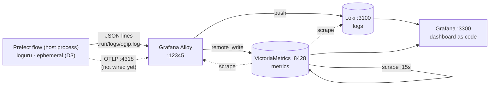

<!-- ru-translation-of: docs/architecture/observability.md sha:edc24a805090 -->
<!-- Автоперевод. Источник — docs/architecture/observability.md. Правьте источник, затем /translate-md-docs-to-russian. -->

> 🇬🇧 English original: [observability.md](observability.md)

# OGIP — Наблюдаемость

Как наблюдают за платформой: **логи → Loki**, **метрики → VictoriaMetrics**, оба собираются
через **Grafana Alloy** и читаются через **один provisioned-дашборд Grafana**. Легковесно по
замыслу ([`.ai/PLAN.md`](../../.ai/PLAN.md) A10) — одиночные бинарники, без Kubernetes, без
кластерного режима.

Стек **опционален**: продакшн-пайплайн проходит зелёным и без него. Запуск —
`make obs-up`, остановка — `make obs-down`. Файлы: [`deploy/obs/`](../../deploy/obs/).

## Топология



Пайплайн — это **короткоживущий host-процесс**, а не контейнер, поэтому метрики
**проталкиваются** (OTLP → Alloy → remote-write), их никогда не скрейпят. Скрейпинг
зарезервирован для здоровья самого стека
([`deploy/obs/victoriametrics/scrape.yml`](../../deploy/obs/victoriametrics/scrape.yml)).

## Компоненты

| Компонент | Порт | Роль | Конфиг |
|---|---|---|---|
| VictoriaMetrics | 8428 | хранилище метрик (Prometheus-совместимое), retention 30 дней | [`scrape.yml`](../../deploy/obs/victoriametrics/scrape.yml) |
| Loki | 3100 | хранилище логов (одиночный бинарник, файловая система) | дефолт образа (`local-config.yaml`) |
| Alloy | 12345 · 4317/4318 | коллектор: читает логи → Loki; OTLP на вход → VictoriaMetrics | [`config.alloy`](../../deploy/obs/alloy/config.alloy) |
| Grafana | 3300 | дашборды + источники данных, provisioned с диска | [`provisioning/`](../../deploy/obs/grafana/provisioning/) |

Grafana по умолчанию с анонимным просмотром (локальное демо); админ — `admin`/`admin`, если
`GRAFANA_ADMIN_USER` / `GRAFANA_ADMIN_PASSWORD` не заданы в `.env`.

## Контракт логирования

`src/ogip/logger.py` оборачивает **loguru**. При `json_logs=True` он выдаёт по одному
JSON-объекту на строку (обёртка loguru `serialize=True`), а связанный контекст (`source`,
`entity`, `flow_run_id`) едет в `record.extra` — ровно это и парсит Alloy:

| JSON-путь | Становится | Зачем |
|---|---|---|
| `record.level.name` | лейбл `level` | срез по важности |
| `record.extra.source` | лейбл `source` | срез по источнику данных (rawg, steam…) |
| `record.extra.entity` | лейбл `entity` | срез по сущности (games…) |
| `record.extra.flow_run_id` | содержимое строки, **не** лейбл | высокая кардинальность раздула бы Loki |
| `text` | отрендеренная строка лога | люди читают сообщения, а не обёртки |

Строки в виде обычного текста (текущее значение по умолчанию) тоже отправляются — Alloy
применяет JSON-парсинг только к строкам, начинающимся с `{`, так что оба формата
сосуществуют.

## Порты и разрыв в SSoT

Порты живут в [`config/config.yml`](../../config/config.yml) → `services:` (SSoT) и попадают в
compose через отрендеренный `.env`. **Известный разрыв:** `config/.env-render.py` пока не
маппит obs-порты в `.env`, поэтому `docker-compose.obs.yml` откатывается к дефолтам вида
`${VICTORIAMETRICS_PORT:-8428}`, которые зеркалят литералы из SSoT. Закрытие разрыва (три
строки в `_derived()`) — это [handoff в lane `core-pipeline`](../../.ai/STATUS.md); до тех пор
фолбэки позволяют стеку подниматься с чистого checkout'а.

## Проверка

```bash
make obs-up            # start + assert every endpoint answers (just obs-verify)
just obs-smoke-log     # accept-check: file → Alloy → Loki → query round-trip
just obs-logs alloy    # tail a component
make obs-down          # stop (volumes preserved)
```

`up --wait` блокируется на compose-хелсчеках, которые VM, Loki и Grafana обслуживают сами
через busybox `wget` в своих образах. **Alloy — исключение**: `grafana/alloy` не несёт
HTTP-клиента (нет wget/curl/nc), поэтому хелсчек ссылался бы на отсутствующий бинарник и
навсегда оставил бы контейнер unhealthy, подвесив ожидание. Поэтому у Alloy хелсчека нет, а
[`src/scripts/obs-verify.sh`](../../src/scripts/obs-verify.sh) проверяет его с хоста — вместе с
каждым опубликованным портом, и это и есть проверка, которая реально важна пользователю
(контейнер может быть healthy при сломанном маппинге порта).

Одна острая грань, которую стоит держать в уме: хелсчек VM пробит `127.0.0.1`, а не
`localhost` — VictoriaMetrics слушает только IPv4, а busybox `wget` сначала пробует `::1` и
получает отказ.

## Алертинг

Стек выше отвечает на вопрос *что происходит*. Алертинг отвечает на *кому-то нужно узнать
сейчас* — [`src/ogip/alerting/`](../../src/ogip/alerting/), абстракция `Notifier` из
[PLAN](../../.ai/PLAN.md) A10. Бизнес-код говорит, что случилось; он никогда не узнаёт, куда
это уходит.

```python
from ogip.alerting import make_notifier

notifier = make_notifier()          # None when no transport is configured
if notifier:
    notifier.notify("ingest failed: rawg 503")
```

| Слой | Отвечает на | Реализации |
|---|---|---|
| `Messenger` (протокол) | **как** доставить в одном бэкенде | Telegram (Bot API) · Mattermost (REST-токен, фолбэк на webhook) · Slack (Web API, webhook) |
| `Notifier` | **доставлять ли / что**: dry-run, фолбэк, результат-не-исключение | один, конкретный |

Маршрутизация: `OGIP_ALERT_BACKEND` (по умолчанию `telegram`),
`OGIP_ALERT_FALLBACK_BACKEND` (пусто = нет), `OGIP_ALERT_DRY_RUN`. Учётные данные: `OGIP_TG_*`
· `OGIP_MM_*` · `OGIP_SLACK_*`. Всё с префиксом `OGIP_` по той же причине, по которой это
понадобилось для `PREFECT_API_URL` — голый `SLACK_TOKEN` в `.env` столкнулся бы с чем угодно
ещё, что читает этот файл.

Четыре решения, которые стоит знать, потому что каждое кодирует способ, которым это идёт не
так:

- **`notify()` никогда не бросает исключение.** Алерт, который бросает, превращает «пайплайн
  деградировал» в «пайплайн упал, пока жаловался». Он возвращает `NotifyResult`; ложное
  значение означает недоставку.
- **Доставка через фолбэк — всё равно деградация.** Она сообщает `sent=True`, но с именем
  бэкенда *фолбэка* и с причиной, называющей первичный бэкенд, который упал — алерт выживает, а
  поломка остаётся видимой. Тишина скрывала бы мёртвый первичный бэкенд бесконечно.
- **Никаких ретраев.** Падающий первичный бэкенд сразу уходит на фолбэк, а не паркует и без
  того несчастливый пайплайн за backoff.
- **Slack отвечает `HTTP 200`, когда падает**, вкладывая вердикт в `{"ok": false}`. Обработка
  только кода статуса проглотила бы каждый такой алерт, поэтому `ok` проверяется и бросается
  дальше.

Алертинг опционален: без учётных данных `make_notifier()` возвращает `None`, и пайплайн
проходит зелёным и тихо — тот же путь демо с нулём учётных данных, что и у источников.
`OGIP_ALERT_DRY_RUN=true` показывает превью алертов вообще без учётных данных.

## Агентная телеметрия (эпик #33)

Стек также наблюдает за **агентами, которые строят OGIP** — стандартные инструменты от края
до края, ноль кастомных коллекторов: **нативный экспорт OTel** Claude Code → тот же приёмник
OTLP в Alloy (`:4318`) → VictoriaMetrics (метрики) + Loki (события) → дашборд **OGIP —
Agentic Activity** (`ogip-agentic`) и два агентных правила алертов (`agent-api-error-burst`,
`agent-cost-burn`).

**Opt-in**, на каждой машине: блок env живёт в `.claude/settings.local.json` (не под
контролем версий). Каждая панель/алерт деградируют до пустого/тихого, когда не выполнялось ни
одной сессии с включённой телеметрией — отсутствие означает простой, а не поломку
(`obs-verify` печатает `agentic telemetry: absent|metrics|metrics+events` как заметку,
никогда как ошибку). Промоушен в закоммиченный `.claude/settings.json` предложен в
[#9](https://github.com/dataengy/ogip/issues/9) — экспортёр **молчит, когда стек не поднят**
(проверено), поэтому закоммиченное включение ничего не стоит сессиям.

Проверенные серии/лейблы (спайк 2026-07-19, `.tmp/MANIFEST.agentic-obs.md`):
`claude_code_token_usage_tokens_total{model,type=input|output|cacheRead|cacheCreation,session_id}` ·
`claude_code_cost_usage_USD_total{model}` · `claude_code_session_count_total` ·
`claude_code_active_time_seconds_total`; события Loki `{service_name="claude-code"}` с
`event_name` = api_request | api_error | assistant_response | tool_decision | tool_result |
hook_execution_* (атрибуты: `tool_name`, `success`, `duration_ms` — панели
tool/subagent/skill — это обычный LogQL `| json` поверх них).

Две острые грани, обе несущие нагрузку:

- **`OTEL_EXPORTER_OTLP_METRICS_TEMPORALITY_PREFERENCE=cumulative` обязателен.** Claude Code
  по умолчанию экспортирует delta-темпоральность, а prometheus-экспортёр Alloy **молча
  отбрасывает delta** — нигде никакой ошибки, метрики просто никогда не доходят до VM.
- **Метрики/события по умолчанию несут идентификаторы пользователя** (email, org id).
  Приемлемо только потому, что стек биндится на localhost; никогда не выставляйте
  :3300/:8428 наружу и никогда не хардкодьте эти значения в закоммиченных файлах (гейты
  `public-hygiene.sh`).

История/офлайн-просмотр: `just agentic-usage` (ccusage через npx — стандартный OSS-ридер
поверх `~/.claude/projects/*.jsonl`); срез по проекту делается в Grafana, ccusage даёт
таблицы токенов+стоимости по дням/сессиям.

## Ещё не подключено

| Разрыв | Владелец | Изменение |
|---|---|---|
| Flow не пишет лог-файл | lane `core-pipeline` | `pipelines/flows/` вызывает голый `setup_logging()`; передать `log_file=settings.log_file`, `json_logs=settings.log_json` (оба уже существуют в `src/ogip/config.py`). Также вооружает закомментированное правило алерта `no-pipeline-logs` (`provisioning/alerting/rules.yml`) |
| Нет метрик пайплайна | lane `core-pipeline` | экспорт OTLP в `localhost:4318`, префикс `ogip_` — панель дашборда уже ждёт |
| Конфиг алертинга только через env | lane `core-pipeline` | маршрутизация живёт в env-переменных `OGIP_ALERT_*`, а не в SSoT — добавить секцию `alerting:` в `config/config.yml`, замаппить её в `config/.env-render.py` (плюс слоты секретов `OGIP_TG_BOT_TOKEN`/`OGIP_TG_CHAT_ID`, которые также читает контакт-пойнт Grafana), затем заменить литеральные дефолты в `alerting/settings.py` на `_yaml("alerting", …)` |
| ~~Пока ничто не поднимает алерт~~ | ~~оба~~ | **закрыто 2026-07-19**: отказы flow алертят через хуки `on_failure` на каждом engine-flow (`pipelines/flows/_common.py` → `Notifier`), а Grafana доставляет алерты по правилам напрямую в Telegram через свой **нативный контакт-пойнт** (`provisioning/alerting/` — без кастомного webhook-приёмника; #26 перепрофилирован) |
| Трейсы | отложено | нет Tempo — сначала логи + метрики |

Пока не закрыт первый разрыв, `.run/logs/` держит только то, что пишет `just obs-smoke-log`, и
панели логов остаются пустыми. Сам стек при этом полностью живой — его собственное здоровье
это реальные данные.
