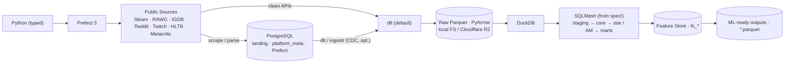

# OGIP — Architecture Overview

**OGIP · Open Games Intelligence Platform** — a Market Intelligence Platform that collects
public gaming-market data and turns it into **ML-ready Parquet datasets** for Data Scientists,
ML Engineers, and Analysts. The production path is deliberately lean; every experiment is
quarantined into `experimental/` or [`docs/comparisons/`](../comparisons/).

> This overview is the entry point; [`.ai/PLAN.md`](../../.ai/PLAN.md) Part A is the fuller
> reference until the per-topic sub-docs are written. Decisions are recorded as [ADRs](../adr/);
> unresolved requirement questions (with defaults + decision triggers) in
> [OPEN-QUESTIONS](../OPEN-QUESTIONS.md).

## Production pipeline

## Layer stack (classical EDW, no medallion — [ADR-0001](../adr/ADR-0001-edw-layering-no-medallion.md))

`0 raw <system>__<table>` (1:1 as-is) → `1 stg_*` → `2 core` (3NF + partial Data Vault) →
`3 *_fact/*_dim` (Kimball star) → `4 am_<entity>_stream` ([Activity Schema](https://www.activityschema.com/)) →
`5 owt_*/agg_*` (marts) → `6 fs_*` (feature store).

## Key decisions (ADR index)

| Area | Choice | ADR |
|---|---|---|
| Engine | DuckDB (in-process OLAP) | [0002](../adr/ADR-0002-duckdb-analytical-engine.md) |
| Lake | Parquet on FS/R2 (Iceberg/DuckLake deferred) | [0003](../adr/ADR-0003-parquet-lake-defer-iceberg-ducklake.md) |
| Transform | SQLMesh (default), from spec | [0004](../adr/ADR-0004-sqlmesh-default-transform-engine.md) |
| Spec SSoT | Bruin format + ODCS + compiler | [0005](../adr/ADR-0005-spec-ssot-bruin-odcs-compiler.md) |
| Ingestion | dlt default + Postgres landing; ingestr/CDC opt. | [0006](../adr/ADR-0006-dlt-default-ingestion-postgres-landing.md) |
| Scraping | async-first `ScraperSource`; effectively-once landing | [0014](../adr/ADR-0014-resilient-scraping-concurrency.md) |
| Orchestration | Prefect 3 + runnable alt setups | [0007](../adr/ADR-0007-prefect-orchestration.md) |
| Product | ML outputs + Feature Store (no BI/semantic core) | [0009](../adr/ADR-0009-ml-outputs-feature-store.md) |
| Modeling | 3NF · Data Vault · Kimball · Activity Schema | [0010](../adr/ADR-0010-activity-model-layer.md) |

## Component map

`src/ogip/` (typed core + spec compiler) · `ingestion/` (base + sources) · `spec/` (SSoT) ·
`transform/` (SQLMesh) · `dq/` · `pipelines/` (Prefect) · `outputs/`+`notebooks/`+`examples/` ·
`experimental/` (alt engines/orchestration, Python dataframe tasks, semantic, Evidence, FS-tool) ·
`deploy/` · `config/`.

The [Python-task demo](../../experimental/python_tasks/README.md) is intentionally outside
the production SQLMesh path. It demonstrates pandas and Polars tasks over existing RAWG/core
relations and defines the dataframe boundary expected when these tasks are later adapted to a
SQL-transform-tool Python-task runtime.
