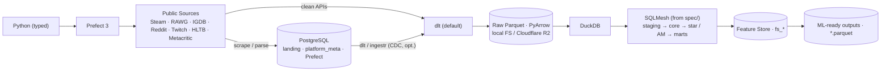

<!-- ru-translation-of: docs/architecture/overview.md sha:57afd6084a21 -->
<!-- Автоперевод. Источник — docs/architecture/overview.md. Правьте источник, затем /translate-md-docs-to-russian. -->

> 🇬🇧 English original: [overview.md](overview.md)

# OGIP — Обзор архитектуры

**OGIP · Open Games Intelligence Platform** — Market Intelligence Platform, которая собирает
публичные данные игрового рынка и превращает их в **ML-ready наборы данных Parquet** для Data Scientists,
ML Engineers и аналитиков. Производственный путь намеренно тонок; каждый эксперимент
изолирован в `experimental/` или [`docs/comparisons/`](../comparisons/).

> Этот обзор — точка входа; часть A [`.ai/PLAN.md`](../../.ai/PLAN.md) является более полным
> справочником, пока не написаны под-документы по темам. Решения фиксируются как [ADR](../adr/);
> нерешённые вопросы требований (с дефолтами + триггерами решений) — в
> [OPEN-QUESTIONS](../OPEN-QUESTIONS.md).

## Производственный пайплайн

## Стек слоёв (классический EDW, без medallion — [ADR-0001](../adr/ADR-0001-edw-layering-no-medallion.md))

`0 raw <system>__<table>` (1:1 как есть) → `1 stg_*` → `2 core` (3NF + частичный Data Vault) →
`3 *_fact/*_dim` (Kimball star) → `4 am_<entity>_stream` ([Activity Schema](https://www.activityschema.com/)) →
`5 owt_*/agg_*` (marts) → `6 fs_*` (feature store).

## Ключевые решения (индекс ADR)

| Область | Выбор | ADR |
|---|---|---|
| Движок | DuckDB (in-process OLAP) | [0002](../adr/ADR-0002-duckdb-analytical-engine.md) |
| Озеро | Parquet на FS/R2 (Iceberg/DuckLake отложены) | [0003](../adr/ADR-0003-parquet-lake-defer-iceberg-ducklake.md) |
| Трансформация | SQLMesh (по умолчанию), из spec | [0004](../adr/ADR-0004-sqlmesh-default-transform-engine.md) |
| Spec SSoT | Формат Bruin + ODCS + компилятор | [0005](../adr/ADR-0005-spec-ssot-bruin-odcs-compiler.md) |
| Ingestion | dlt по умолчанию + посадка в Postgres; ingestr/CDC опц. | [0006](../adr/ADR-0006-dlt-default-ingestion-postgres-landing.md) |
| Скрейпинг | async-first `ScraperSource`; посадка effectively-once | [0014](../adr/ADR-0014-resilient-scraping-concurrency.md) |
| Оркестрация | Prefect 3 + запускаемые альтернативные наборы | [0007](../adr/ADR-0007-prefect-orchestration.md) |
| Продукт | ML-выходы + Feature Store (без BI/семантического ядра) | [0009](../adr/ADR-0009-ml-outputs-feature-store.md) |
| Моделирование | 3NF · Data Vault · Kimball · Activity Schema | [0010](../adr/ADR-0010-activity-model-layer.md) |

## Карта компонентов

`src/ogip/` (типизированное ядро + spec-компилятор) · `ingestion/` (base + sources) · `spec/` (SSoT) ·
`transform/` (SQLMesh) · `dq/` · `pipelines/` (Prefect) · `outputs/`+`notebooks/`+`examples/` ·
`experimental/` (альт. движки/оркестрация, Python-задачи над датафреймами, семантика, Evidence, FS-tool) ·
`deploy/` · `config/`.

[Демо Python-задач](../../experimental/python_tasks/README.md) намеренно находится вне
производственного пути SQLMesh. Оно демонстрирует задачи pandas и Polars над существующими отношениями RAWG/core
и определяет границу датафреймов, ожидаемую при последующей адаптации этих задач к
Python-task runtime SQL-transform-tool.
